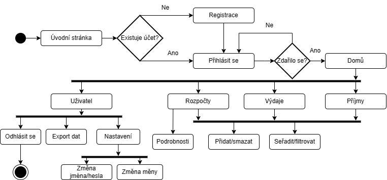

# Zápočet - webová stránka


Webová stránka s aplikací: http://andvag.pythonanywhere.com/


## Postup instalace pro lokální spuštění

1. Naklonujte repozitář
    ```bash
    git clone https://gitlab.jadernaci.cz/vagneand/zapocet.git
    cd zapocet
    ```

2. Vytvořte a aktivujte virtuální prostředí
    ```bash
    python -m venv venv
    venv\Scripts\activate.bat
    ```

3. Nainstalujte závislosti
    ```bash
    pip install -r requirements.txt
    ```
4. Spusťte aplikaci
    ```bash
    python3 app.py
    ```
5. Otevřete aplikaci v prohlížeči
    - [http://localhost:5000](http://localhost:5000)
    



         